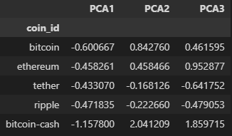

# CryptoClustering
Module 19 Challenge

### Steps taken

- Prepare the Data

- Find the Best Value for k Using the Original Scaled DataFrame

- Cluster Cryptocurrencies with K-means Using the Original Scaled Data

- Optimise Clusters with Principal Component Analysis

- Find the Best Value for k Using the PCA Data

- Cluster Cryptocurrencies with K-means Using the PCA Data

- Answer the following question:
    - What is the impact of using fewer features to cluster the data using K-Means?
        
        Using PCA, the cluster is more defined and data clustered closer together. Outliers are also easily identified with outliers being celsius degree token and ethlend. 

---- 

Code source: 

Code obtained from using class activities 

